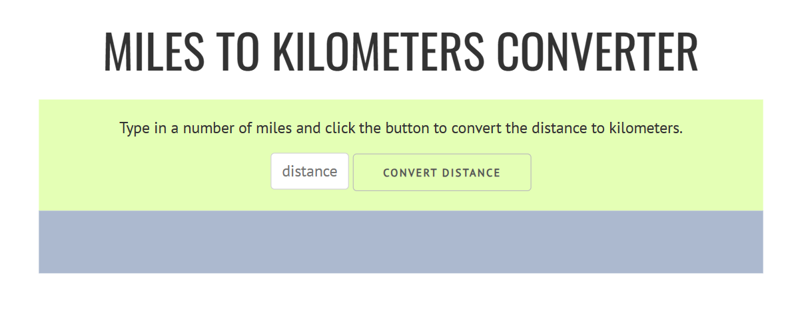

# 🌐 Distance Converter App

## Overview

This is a simple web app that allows users to convert distances between miles and kilometers. The app provides a user-friendly interface for quick and easy conversions.

## App Preview

[](https://jen67.github.io/Cousera-javascript-course/Distance-converter-app/index.html)  

*👆 Click the image above to access the live site.*

## Usage

1. **Select Conversion Type:**
   - Press 'K' key for Kilometers to Miles conversion.
   - Press 'M' key for Miles to Kilometers conversion.

2. **Enter Distance:**
   - In the input field labeled "Distance," type the numerical value of the distance you want to convert.

3. **Submit Conversion:**
   - Click the "Convert" button or press the 'Enter' key to see the converted distance.

4. **View Result:**
   - The converted distance will be displayed below the input field.

## ⌨️ Keyboard Shortcuts

- Press 'K' for Kilometers to Miles conversion.
- Press 'M' for Miles to Kilometers conversion.

## Examples

- Converting 10 miles to kilometers:

  ```plaintext
  10 miles converts to 16.093 kilometers
