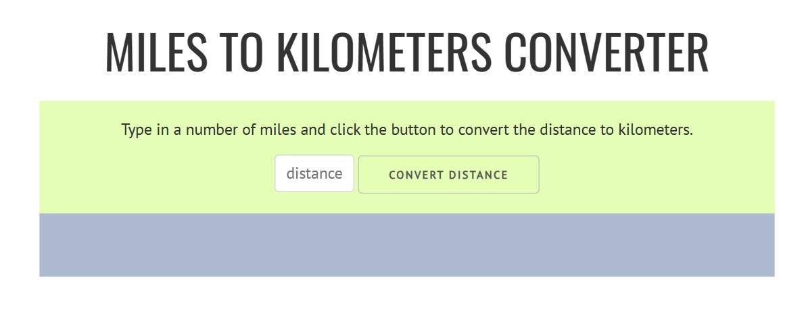

# Coursera JavaScript Course Repository

This repository contains tasks and projects from the Coursera JavaScript course in which I am currently enrolled.

## Projects in this Repository

### 1. Distance App Calculator

   [👉 ](https://jen67.github.io/Cousera-javascript-course/Distance-converter-app/index.html)

- **👆 Click the image above to access the live site.**

### 2. Simple Slide Show

   [👉 ](https://jen67.github.io/Cousera-javascript-course/simple-slide-show/index.html)

- **👆 Click the image above to view the live slideshow.**

### 3. Vacation Destination Card Marker

   [👉 ](https://jen67.github.io/Cousera-javascript-course/Vacation-Destination-landing-page/index.html)

- **👆 Click the image above to view the live slideshow.**
