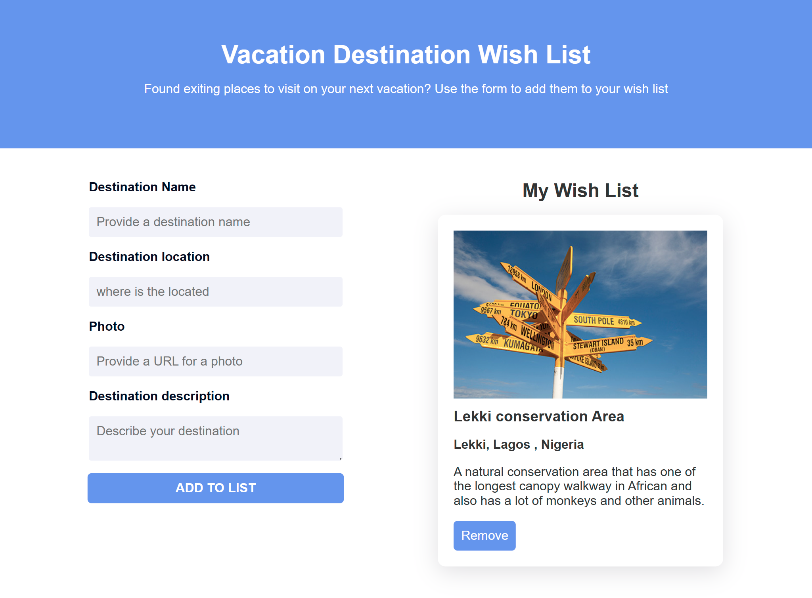

# Vacation Destinations WishList 🌍✈️

👆 Click the image above to view the live site.

## Overview 🚀

Welcome to the Vacation Destinations WishList app! 🌟 This JavaScript-powered web application allows users to create a personalized wish list of dream vacation destinations. Use the provided form to add your desired locations, complete with names, locations, photos, and descriptions. Your wish list will be dynamically displayed with interactive cards for each destination.

## How to Use 🤔

1. **Form Submission** 📝: Fill out the form with details about your dream destination, including the name, location, a photo URL (optional), and a description. Click the "Add to List" button to submit.

2. **Wish List Display** 🗂️: Your wish list will be dynamically updated and displayed in the main section with interactive cards for each destination.

3. **Card Interactions** 🎉:
   - Click on a card's "Remove" button to delete the destination from your wish list.

## JavaScript Functions 🚀

### `handleFormSubmit(event)`

- Prevents the default form submission behavior.
- Retrieves destination details from the form.
- Clears the form fields.
- Creates a destination card using `createDestinationCard`.
- Appends the card to the wish list container.

### `createDestinationCard(name, location, photoUrl, description)`

- Creates a destination card dynamically.
- Sets the image source based on the provided photo URL or uses a default image.
- Constructs the card body with destination name, location, and description.
- Adds a "Remove" button with the `removeDestination` event listener.

### `removeDestination(event)`

- Removes the clicked destination card from the wish list.
