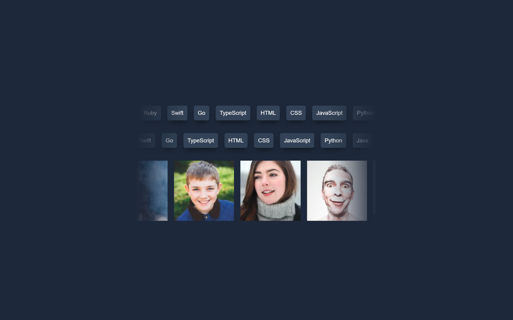

# Coding Languages Scroller 🚀

A simple web project to showcase coding languages in a horizontal scrolling fashion.

## Table of Contents

- [Coding Languages Scroller 🚀](#coding-languages-scroller-)
  - [Table of Contents](#table-of-contents)
  - [Overview](#overview)
  - [Features](#features)
  - [Animations](#animations)

## Overview

This project is a minimalistic web page that displays coding languages and images in a horizontally scrolling manner. It utilizes CSS animations and masks to create a visually appealing effect.
I followed along Kelvin Powells tutorial and make some changes.

[](https://jen67.github.io/Cousera-javascript-course/scroll-effect/index.html)

👆 Click the image above to view the live demo.

## Features

- Responsive design for various screen sizes.
- Smooth and customizable scrolling animations.
- Dark mode support using CSS color scheme.

## Animations

The project comes with a default scrolling animation. You can customize the speed and direction of the animation by adding specific data attributes to the HTML:

- `data-animated="true"`: Enables animation.
- `data-direction="right"`: Scrolls to the right.
- `data-direction="left"`: Scrolls to the left.
- `data-speed="slow"`: Slower scrolling speed.
- `data-speed="fast"`: Faster scrolling speed.

Example:

```html
<div class="scroller" data-animated="true" data-direction="right" data-speed="fast">
</div>
